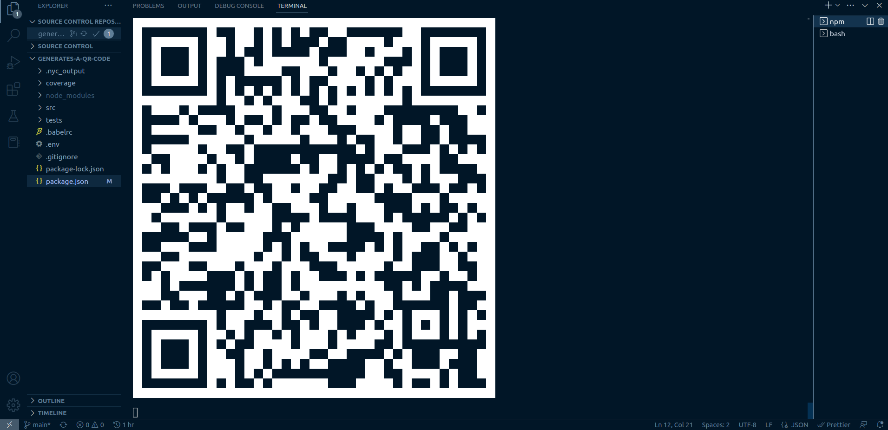
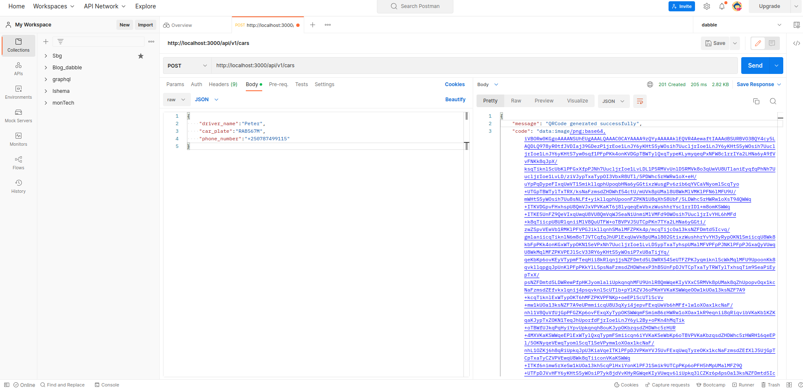

---
## Project setup
---
### Start Up
* Clone the repository
* install node js and npm
* open project directory
* Install packages by running `npm install`

### Running server
- Run `npm run dev` to run server local

### Running tests
- Run `npm test` to run tests

images

### Api Production Link
[Production Link](https://generate-qrcode.onrender.com)

### Api Documentation
[Postman Documentation](https://documenter.getpostman.com/view/10455629/2s93CUHqDi)

